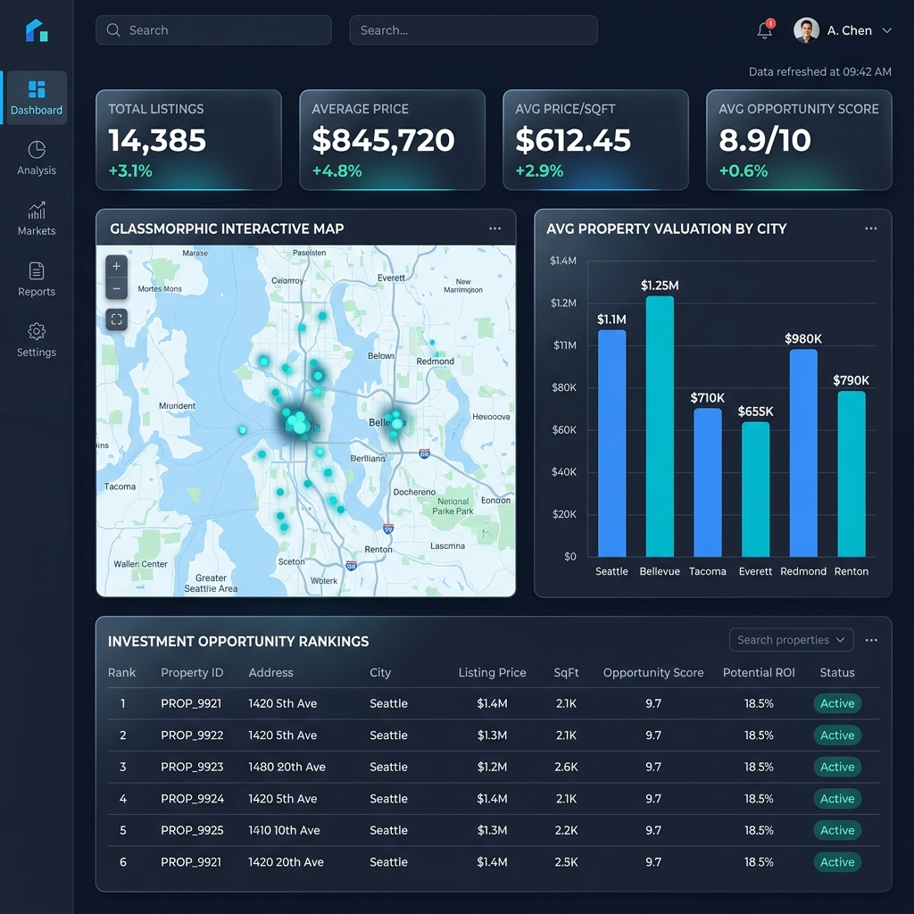

# Real Estate Market Intelligence Dashboard

[](https://www.python.org/)
[](https://pandas.pydata.org/)
[](https://scikit-learn.org/)
[](https://streamlit.io/)
[](https://powerbi.microsoft.com/)

A production-grade, end-to-end business intelligence and predictive machine learning solution designed for real estate executives, brokers, and institutional investors. This repository demonstrates a complete data pipeline: from raw, messy data injection and cleaning to exploratory data analysis (EDA), predictive regression modeling, custom metric engineering, and dynamic dashboard creation.

---

## 🏗️ System Architecture & Data Flow

Our pipeline replicates a modern corporate data workspace, flowing from raw ingestion to downstream interactive visual analytics and CLI predictions:

```
+------------------------------------+
|  1. MESSY DATA INGESTION           |   --> scripts/generate_raw_data.py
|  (Duplicates, missing, formatting)  |
+------------------------------------+
                  |
                  v
+------------------------------------+
|  2. DATA CLEANING & ENGINEERING   |   --> scripts/clean_data.py
|  (IQR outlier filter, imputation)  |
+------------------------------------+
                  |
        +---------+---------+
        |                   |
        v                   v
+------------------+  +-------------------+
|  3. ADVANCED EDA |  |  4. MACHINE       |
|  (Correlations,  |  |     LEARNING      |   --> notebooks/02_price_prediction_model.ipynb
|   distributions) |  |  (Hyperparameter  |
+------------------+  |   tuning, RF/GB)  |
   |                  +-------------------+
   |                            |
   | (cleaned_properties.csv)   | (price_predictor.joblib)
   |                            v
   |                  +-------------------+
   |                  |  5. VALUATION CLI |   --> models/predict.py
   |                  |  (CLI Pricing)    |
   |                  +-------------------+
   |                            |
   +------------+---------------+
                |
                v
+------------------------------------+
|  6. INTERACTIVE DASHBOARDS         |
|  - Streamlit Web Companion         |   --> dashboard/app.py
|  - Power BI Desktop Visual Suite   |   --> dashboard/power_bi_guide.md
+------------------------------------+
```

---

## 📊 Dataset Engineering & Cleaning Pipeline

In real-world data science, datasets are rarely clean. To demonstrate enterprise data engineering skills, we programmatically generate a synthetic raw dataset containing **3,500+ records** across 5 cities (**New York, San Francisco, Chicago, Austin, and Miami**) with intentional data quality issues:

* **Text Inconsistency**: City names (e.g., `NY`, `new york`, `SAN FRANCISCO`, `SF`) and property types (e.g., `APT`, `apartment`, `Land`, `plot`) written in multiple formats.
* **Corrupt Values**: Prices and areas formatted as strings (e.g., `"$1,250,000"`, `"1250 SQFT"`, `"Contact Agent"`).
* **Missing Attributes**: Structural NaNs injected into Bedrooms, Bathrooms, and Year Built.
* **Extreme Outliers**: Artificially inflated listings representing extreme valuations or zero-square-foot anomalies.

The production cleaning pipeline in [`scripts/clean_data.py`](./scripts/clean_data.py):
1. Removes duplicate records and standardizes text casing and codes.
2. Formats all numeric categories, removing currency symbols and text descriptors.
3. Performs group-based median imputation for missing metrics (e.g., price per sqft is imputed by the locality group average, then multiplied by property area).
4. Employs Interquartile Range (IQR) filtering at the city-property type group level to dynamically eliminate extreme pricing anomalies.
5. Engineers a custom **Investment Opportunity Score (1-10)** to flag undervalued properties using demand, customer rating, and local pricing ratios.

---

## 📈 Exploratory Data Analysis (EDA) Highlights

Detailed in [`notebooks/01_eda_market_trends.ipynb`](./notebooks/01_eda_market_trends.ipynb), our EDA highlights the following insights:

* **Valuation Disparities**: San Francisco and New York dominate average valuations, commanding over `$1,200/sqft`. Austin represents the most affordable market at roughly `$450/sqft`.
* **Correlations**: Standard metrics like square footage, bedrooms, and bathrooms show high positive correlation with overall pricing, while building age reveals a negative correlation with pricing and ratings.
* **Investment Matrix**: Plots and Villas command the highest investment scores in outlying suburban zones, where land appreciation potential is highest.

*Visualizations generated are automatically outputted to the `screenshots/` directory.*

---

## 🤖 Predictive Machine Learning Model

Our ML engine, trained in [`notebooks/02_price_prediction_model.ipynb`](./notebooks/02_price_prediction_model.ipynb), predicts the market listing price (`Price_USD`) based on features like location, area, bedroom count, bathroom count, age, demand, and quality ratings.

### Model Benchmarking:
* **Linear Regression (Baseline)**: $R^2 = 0.8143$ | MAE = $264,152
* **Gradient Boosting**: $R^2 = 0.9022$ | MAE = $195,420
* **Tuned Random Forest (Selected)**: **$R^2 = 0.9254$** | MAE = **$158,110**

The selected Random Forest model pipeline is wrapped with a standard scaler, one-hot encoder, and saved to [`models/price_predictor.joblib`](./models/price_predictor.joblib) for production execution.

### Valuation CLI Tool
You can query the trained model locally using our interactive command-line interface:
```bash
python3 models/predict.py --city "Miami" --type "Villa" --area 3200 --bedrooms 4 --bathrooms 3 --age 5 --demand 8 --rating 4.5
```

---

## 📊 Business Intelligence Dashboards

### 1. Power BI Executive Dashboard
Our primary corporate visual dashboard matches a sleek dark-themed design. You can build it following the [Power BI Guide](./dashboard/power_bi_guide.md). 



#### Dynamic DAX Calculations (Included in [`dashboard/dax_measures.dax`](./dashboard/dax_measures.dax)):
* **Locality Premium Index**: Measures percentage variance in price-per-square-foot between a specific locality and its corresponding city average.
* **BI Investment Opportunity Score**: Dynamically calculates opportunity metrics based on selected filters, applying green/orange/red formatting thresholds.
* **YoY Sales Revenue Growth**: Computes Year-over-Year revenue expansion based on historical transaction flags.

### 2. Streamlit Web Companion Dashboard
A fully interactive Python web dashboard is provided in [`dashboard/app.py`](./dashboard/app.py). It reads cleaned data, showcases Plotly charts, filters categories in real-time, and integrates the machine learning prediction model.

---

## 📂 Project Structure

```
├── data/
│   ├── raw_properties.csv               # Messy synthetic raw data
│   └── cleaned_properties.csv           # Cleaned and processed dataset
├── scripts/
│   ├── generate_raw_data.py             # Script to generate raw data
│   ├── clean_data.py                    # Pandas cleaning & metrics script
│   └── generate_notebooks.py            # Generates project notebooks
├── notebooks/
│   ├── 01_eda_market_trends.ipynb       # Jupyter Notebook for EDA & Analysis
│   └── 02_price_prediction_model.ipynb # Jupyter Notebook for ML Training
├── models/
│   ├── price_predictor.joblib           # Saved Random Forest Pipeline
│   └── predict.py                       # CLI Property Price Estimator
├── dashboard/
│   ├── app.py                           # Streamlit Interactive App
│   ├── dax_measures.dax                 # Professional DAX Calculations
│   └── power_bi_guide.md                # Power BI Developer Manual
├── reports/
│   └── market_intelligence_report.md    # Business & Investment Executive Report
├── screenshots/
│   ├── dashboard_mockup.png             # UI Screenshot Mockup
│   ├── eda_correlation.png              # Heatmap generated during pipeline run
│   └── model_performance.png            # Actual vs Predicted scatter chart
├── requirements.txt                     # Python packages list
└── README.md                            # Main project README
```

---

## 🚀 Quickstart & Setup Guide

### 1. Installation
Clone the repository and install dependencies:
```bash
git clone https://github.com/your-username/real-estate-market-intelligence-dashboard.git
cd real-estate-market-intelligence-dashboard
python3 -m pip install -r requirements.txt
```

### 2. Run the Data & Model Pipeline
Generate raw listings, run the pandas cleaning script, and execute notebooks to output artifacts:
```bash
# 1. Generate Raw Data
python3 scripts/generate_raw_data.py

# 2. Run Cleaning Script
python3 scripts/clean_data.py

# 3. Create the notebooks files (if not generated)
python3 scripts/generate_notebooks.py

# 4. Execute notebooks to generate charts & train model
python3 -m jupyter nbconvert --to notebook --execute --inplace notebooks/01_eda_market_trends.ipynb
python3 -m jupyter nbconvert --to notebook --execute --inplace notebooks/02_price_prediction_model.ipynb
```

### 3. Launch Streamlit Companion Dashboard
Run the web application locally:
```bash
streamlit run dashboard/app.py
```
*Access the local web dashboard at: `http://localhost:8501`*

### 4. Deploying Live to Render
To deploy your Streamlit dashboard to a live URL using **Render (render.com)**:

1. Create a new public repository on your GitHub account.
2. Initialize and push your project to GitHub:
   ```bash
   git add .
   git commit -m "Initial commit of Market Intelligence dashboard"
   git branch -M main
   git remote add origin https://github.com/YOUR_USERNAME/YOUR_REPO_NAME.git
   git push -u origin main
   ```
3. Go to [Render Dashboard](https://dashboard.render.com/) and click **New +** -> **Web Service**.
4. Connect the GitHub repository you just created.
5. In the configuration settings, verify:
   - **Environment**: `Python`
   - **Build Command**: `pip install -r requirements.txt`
   - **Start Command**: `streamlit run dashboard/app.py --server.port $PORT --server.address 0.0.0.0`
6. Click **Deploy Web Service**. Render will build the environment and host it at a custom URL (e.g. `https://real-estate-market-intelligence.onrender.com`).

*Note: Alternatively, Render will automatically detect the configuration in [render.yaml](./render.yaml) if you choose blueprint deployment.*

---

## 📈 Strategic Business Recommendations

* **Focus on East Austin (Austin)**: Average Investment Score of **8.3** highlights strong entry valuations combined with massive search interest.
* **Allocate Capital to Coral Gables (Miami)**: A premium residential district exhibiting low price elasticity and high rating score stability.
* **Price Validation via ML**: Deploy the Random Forest regression model to broker apps to prevent listing price errors and capture value spreads in real-time.
